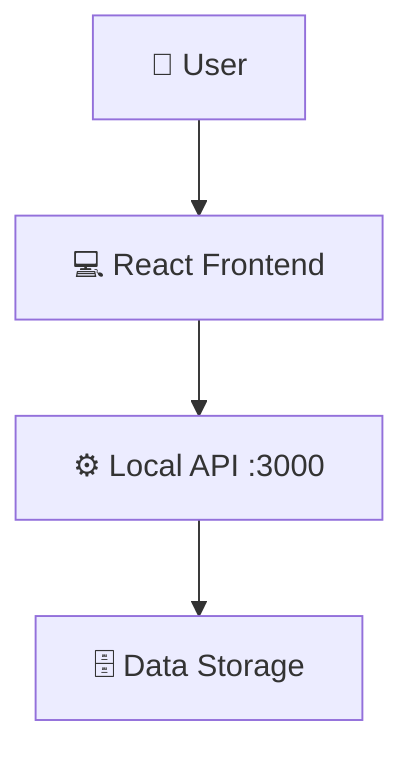

# 💰 Finance Management Application 


<hr/>


📖 About The Project
---

**Finance Management Application** is a modern, **responsive, and user-friendly** Expense Tracker Web App built using **React, Vite, Context API, and TailwindCSS**.
It allows users to **add, edit, delete, filter, and visualize expenses using interactive charts**.
All data is **stored in LocalStorage**, ensuring persistence even after page refresh.

This project focuses on speed, simplicity, and clean UI, making it perfect for portfolio and real-world use.
<hr/>

✨ Key Features
---

-  🔸 **Add New Expenses** 
-  ✏️ **Edit Existing Expenses** 
-  🗑️ **Delete Expenses** 
-  💾 **LocalStorage Saving** 
-  🏷️ **Category Filtering** 
-  📊 **Interactive Charts** 
-  📱 **Responsive UI** 
-  🔔 **Toast Notifications** 
-  🎨 **Modern UI** 

<hr/>

📸 Screenshots
---
### **Main dashboard**


<hr/>

📁 Directory structure
---
The Project is organized as follows:

```
Directory structure:
└── umesh590-finance-management-app/
    ├── README.md
    ├── eslint.config.js
    ├── index.html
    ├── package.json
    ├── vite.config.js
    └── src/
        ├── App.jsx
        ├── index.css
        ├── main.jsx
        ├── components/
        │   ├── Dashboard.jsx
        │   ├── ExpenseBarChart.jsx
        │   ├── ExpenseChart.jsx
        │   ├── ExpenseForm.jsx
        │   ├── ExpenseList.jsx
        │   ├── ExpensePieChart.jsx
        │   └── ExpenseSummary.jsx
        ├── context/
        │   └── ExpenseContext.jsx
        ├── layouts/
        │   └── DashboardLayout.jsx
        ├── pages/
        │   ├── Index.jsx
        │   └── NotFound.jsx
        └── utils/
            └── expenses.js
```
<hr/>

📂 Key Folders & Files
---
**/components** – Contains all reusable UI components.  
**/context** – App state management (Context API).   
**/pages** – Page-level components.  
**/utils** – Utility functions.  
**App.jsx** – Main application component.  
**main.jsx** – React entry point.


<hr/>

🏗️ Architecture
---
The system follows the **simple client-server architecture**
- **Frontend (React + Tailwind):** Handles UI, state, and interactions.
- **Backend API (Local JSON Server at :3000):** Stores and retrieves the data.
 



<hr/>

🛠 Built With
---

- **Frontend**: React 18, vite 5, TailwindCSS 3
- **State Management**: Context API
- **Styling**: TailwindCSS 3

<hr/>

⚙️ Getting Started
---

### **Prerequisites**

- Node.js 18+
- npm / yarn / pnpm
- Local API server running at `http://localhost:3000`

---

### **Installation**

```bash
git clone https://github.com/Umesh590/Finance-Management-App.git
cd Finance-Management-App
npm install
```
<hr/>
 
### **Run** 
```
npm run dev
```
Visit:
```
http://localhost:5173
```
Backend API should be running at:
```
http://localhost:3000
```
<hr/>

📬 Contact
---

👨‍💻 Umesh Kumar<br>
📧 Email: [umeshjha7890@gmail.com](mailto:umeshjha7890@gmail.com)<br>

<hr/>

⭐ **Show Some Love!**
<br><br>

If you liked this project, **please ⭐ star the repository on GitHub!**
